$\frac{\partial \sum}{\partial *} = 1$
$\frac{\partial tanh}{\partial \sum}=1-tanh^2$
$\frac{\partial loss}{\partial \tanh}=tanh-y$
$\frac{\partial *}{\partial w_i}=x_i$
$\frac{\partial loss}{\partial w_i}=(tanh-y)(1-tanh^2)x_i$

![[1.png]]
![[2.png]]
![[3.png]]
